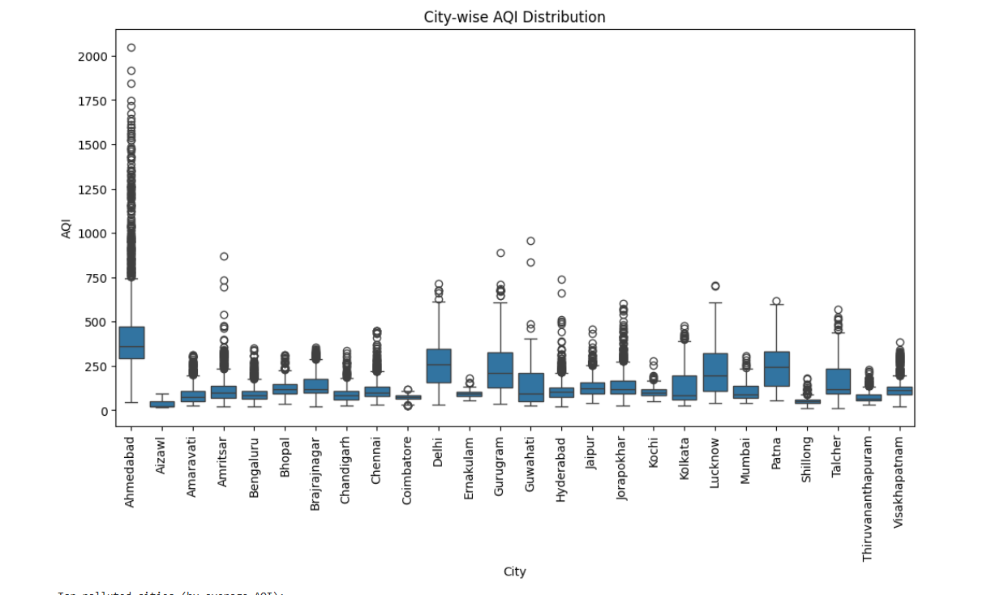
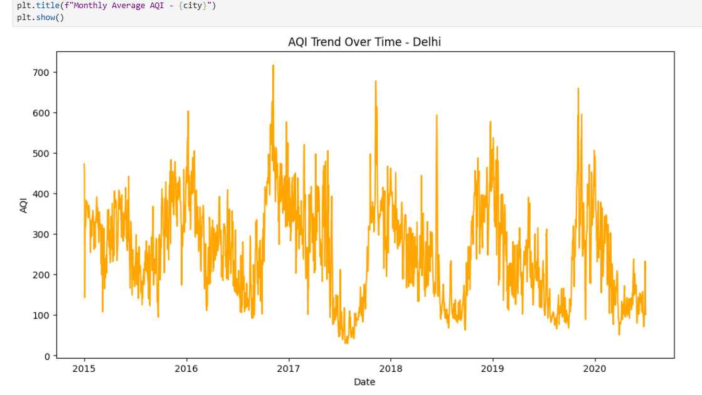
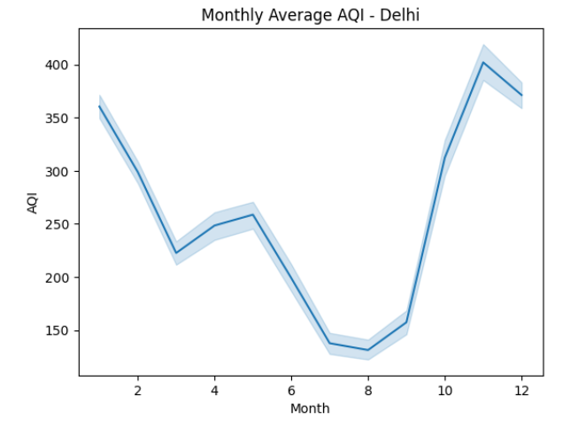
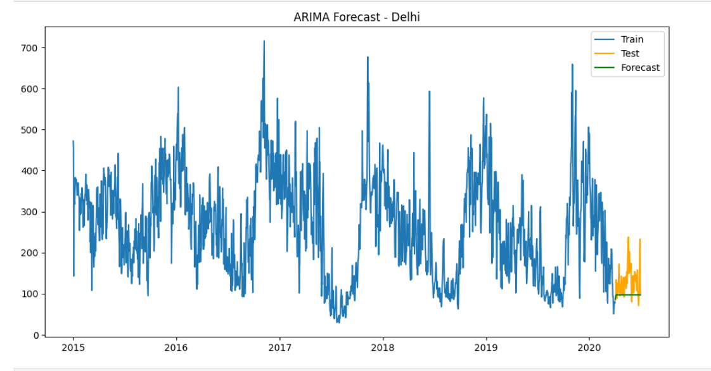

# 🌫️ Air Quality Index (AQI) Analysis & Forecasting – India

This project analyzes **Air Quality Index (AQI) data across major Indian cities** and builds forecasting models like **ARIMA** and **Prophet** to predict future air quality trends.  
Dataset source: Kaggle – *Air Quality Data in India* by Rohan Rao.

---

## 📌 Project Overview

- Cleaned and preprocessed the dataset  
- Converted date columns to proper DateTime format  
- Removed missing/duplicate values  
- Performed Exploratory Data Analysis (EDA)  
- Visualized AQI levels across different cities  
- Built forecasting models for future AQI predictions  
- Compared different models on accuracy scores  

---

## 📊 Features of This Project

✔ Importing & cleaning AQI dataset  
✔ Handling missing values  
✔ Grouping & filtering by cities  
✔ Visualizing AQI using:
- Matplotlib  
- Seaborn  
- Plotly (interactive graphs)

✔ Time-series forecasting using:
- **ARIMA (AutoRegressive Integrated Moving Average)**
- **Prophet Model**

✔ Model evaluation:
- MAE (Mean Absolute Error)  
- RMSE (Root Mean Squared Error)

---

## 🛠️ Installation

In Jupyter Notebook, install the required packages:

```bash
!pip install kaggle
!pip install pandas numpy matplotlib seaborn plotly
!pip install statsmodels
!pip install prophet
!pip install scikit-learn
```

## 📊 Visualizations

### **1️⃣ City-wise AQI Distribution**


### **2️⃣ AQI Trend Over Time – Delhi**


### **3️⃣ Monthly Average AQI – Delhi**


### **4️⃣ ARIMA Forecast – Delhi**

